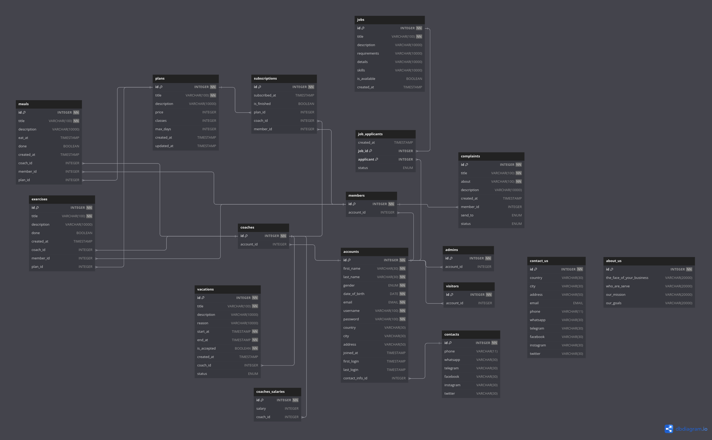

# Database Tables

##### **Use [dbdiagram](https://dbdiagram.io/d/) to render `models.txt`**

### Accounts

```sql
// -------------------------- \\
// =======> Accounts <======= \\
// -------------------------- \\

// Accounts
TABLE accounts {
  id INTEGER [PK, NOT NULL]
  first_name VARCHAR(30) [NOT NULL]
  last_name VARCHAR(30) [NOT NULL]
  gender ENUM('M', 'F') [NOT NULL]
  date_of_birth DATE [NOT NULL]
  email EMAIL [UNIQUE, NOT NULL]
  username VARCHAR(100) [UNIQUE, NOT NULL]
  password VARCHAR(100) [NOT NULL]
  country VARCHAR(30) [NULL]
  city VARCHAR(30) [NULL]
  address VARCHAR(50) [NULL]
  joined_at TIMESTAMP [DEFAULT: `now()`]
  first_login TIMESTAMP [NULL]
  last_login TIMESTAMP [NULL]

  contact_id INTEGER [UNIQUE, ref: > contacts.id]
}
```

### Admins

```sql
// Admins
TABLE admins {
  id INTEGER [PK, NOT NULL]
  account_id INTEGER [UNIQUE, ref: > accounts.id]
}
```

### Coaches

```sql
// Coaches
TABLE coaches {
  id INTEGER [PK, NOT NULL]
  account_id INTEGER [UNIQUE, ref: > accounts.id]
}
```

### Members

```sql
// Members
TABLE members {
  id INTEGER [PK, NOT NULL]
  account_id INTEGER [UNIQUE, ref: > accounts.id]
}
```

### Visitros

```sql
// Visitors
TABLE visitors {
  id INTEGER [PK, NOT NULL]
  account_id INTEGER [UNIQUE, ref: > accounts.id]
}
```

### Contacts Info

```sql
// Contacts
TABLE contacts {
  id INTEGER [PK, NOT NULL]
  phone VARCHAR(11) [NULL]
  whatsapp VARCHAR(30) [NULL]
  telegram VARCHAR(30) [NULL]
  facebook VARCHAR(30) [NULL]
  instagram VARCHAR(30) [NULL]
  twitter VARCHAR(30) [NULL]
}
```

### Salaries

```sql
// Salaries
TABLE coaches_salaries {
  id INTEGER [PK, NOT NULL]
  salary INTEGER [DEFAULT: 0]

  coach_id INTEGER [UNIQUE, ref: > coaches.id]
}
```

---

### Plans

```sql
// ----------------------- \\
// =======> Plans <======= \\
// ----------------------- \\

// Plans
TABLE plans {
  id INTEGER [PK, NOT NULL]
  title VARCHAR(100) [NOT NULL]
  description VARCHAR(10000) [NULL]
  price INTEGER [DEFAULT: 0]
  classes INTEGER [DEFAULT: 0]
  max_days INTEGER [DEFAULT: 0]
  created_at TIMESTAMP [DEFAULT: `now()`]
  updated_at TIMESTAMP
}
```

### Subscriptions

```sql
// Subscriptions
TABLE subscriptions {
  id INTEGER [PK, NOT NULL]
  subscribed_at TIMESTAMP [DEFAULT: `now()`]
  is_finished BOOLEAN [DEFAULT: False]

  plan_id INTEGER [ref: > plans.id]
  coach_id INTEGER [ref: > coaches.id]
  member_id INTEGER [ref: > members.id]
}
```

### Exercises

```sql
// Exercises
TABLE exercises {
  id INTEGER [PK, NOT NULL]
  title VARCHAR(100) [NOT NULL]
  description VARCHAR(10000)
  done BOOLEAN [DEFAULT: False]
  created_at TIMESTAMP [DEFAULT: `now()`]

  coach_id INTEGER [ref: > coaches.id]
  member_id INTEGER [ref: > members.id]
  plan_id INTEGER [ref: > plans.id]
}
```

### Meals

```sql
// Meals
TABLE meals {
  id INTEGER [PK, NOT NULL]
  title VARCHAR(100) [NOT NULL]
  description VARCHAR(10000) [NULL]
  eat_at TIMESTAMP [NULL]
  done BOOLEAN [DEFAULT: False]
  created_at TIMESTAMP [DEFAULT: `now()`]

  coach_id INTEGER [ref: > coaches.id]
  member_id INTEGER [ref: > members.id]
  plan_id INTEGER [ref: > plans.id]
}
```

---

### Complaints

```sql
// ------------------------- \\
// =======> Support <======= \\
// ------------------------- \\

// Complaints
TABLE complaints {
  id INTEGER [PK, NOT NULL]
  title VARCHAR(100) [NOT NULL]
  about VARCHAR(100) [NOT NULL]
  description VARCHAR(10000) [NULL]
  created_at TIMESTAMP [DEFAULT: `now()`]

  member_id INTEGER [ref: > members.id]

  send_to ENUM(1, 2) [DEFAULT: 1]
  // 1: admin
  // 2: coach
  status ENUM(1, 2) [DEFAULT: 1]
  // 1: Not Seen
  // 2: Seen
}
```

### Vacations

```sql

// Vacations
TABLE vacations {
  id INTEGER [PK, NOT NULL]
  title VARCHAR(100) [NOT NULL]
  description VARCHAR(10000) [NULL]
  reason VARCHAR(10000) [NULL]
  start_at TIMESTAMP [NOT NULL]
  end_at TIMESTAMP [NOT NULL]
  created_at TIMESTAMP [DEFAULT: `now()`]

  coach_id INTEGER [ref: > coaches.id]

  status ENUM(1, 2, 3, 4) [DEFAULT: 1]
  // 1: Not Seen
  // 2: Seen
  // 3: Refused
  // 4: Accepted
}
```

---

### Jobs

```sql
// ---------------------- \\
// =======> Jobs <======= \\
// ---------------------- \\

// Jobs
TABLE jobs {
  id INTEGER [PK, NOT NULL]
  title VARCHAR(100) [NOT NULL]
  description VARCHAR(10000) [NULL]
  requirements VARCHAR(10000) [NULL]
  details VARCHAR(10000) [NULL]
  skills VARCHAR(10000) [NULL]
  is_available BOOLEAN [DEFAULT: True]
  created_at TIMESTAMP [DEFAULT: `now()`]
}
```

### Job applicants

```sql
// Jobs Applicants
TABLE job_applicants {
  created_at TIMESTAMP [DEFAULT: `now()`]

  job_id INTEGER [PK, ref: > jobs.id]
  applicant INTEGER [PK, ref: > accounts.id]

  status ENUM(1, 2, 3, 4) [DEFAULT: 1]
  // 1: Not Seen
  // 2: Seen
  // 3: Refused
  // 4: Accepted
}
```

---

### Contact Us

```sql
// -------------------------- \\
// =======> Settings <======= \\
// -------------------------- \\

// Contact us
TABLE contact_us {
  id INTEGER [PK, NOT NULL]
  country VARCHAR(30) [NULL]
  city VARCHAR(30) [NULL]
  address VARCHAR(50) [NULL]
  email EMAIL [NULL]
  phone VARCHAR(11) [NULL]
  whatsapp VARCHAR(30) [NULL]
  telegram VARCHAR(30) [NULL]
  facebook VARCHAR(30) [NULL]
  instagram VARCHAR(30) [NULL]
  twitter VARCHAR(30) [NULL]
}
```

### About us

```sql
// About us
TABLE about_us {
  id INTEGER [PK, NOT NULL]
  the_face_of_your_business VARCHAR(20000) [NULL]
  who_are_serve VARCHAR(20000) [NULL]
  our_mission VARCHAR(20000) [NULL]
  our_goals VARCHAR(20000) [NULL]
}
```

---

## Database ER Diagram

<div align="center">
  
</div>
